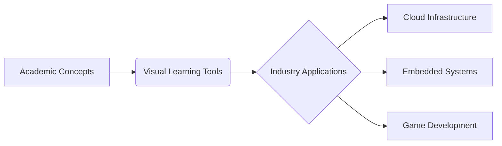

# 🖥️ CSE 405 - Operating Systems

[](https://github.com/UAPians/CSE-405-Operating-Systems/codespaces) 
[](https://github.com/UAPians/CSE-405-Operating-Systems/discussions)

**Bridging Theory and Modern OS Practices Through Visual Learning**

```ascii
          [Student Code] --> [Kernel Concepts] --> [Industry Practice]
                  \                       |                       /
                   \                      |                      /
                    V          [Visual Learning Hub]          V
```

## 🌟 Course Highlights
- **Interactive Simulators** for process scheduling & memory management
- **Real Linux Kernel 6.x** code walkthroughs
- **Cloud-Native OS** case studies (Kubernetes, Firecracker)
- **Visual Concept Maps** using MermaidJS/D2 lang
- **Industry AMAs** with OS engineers from Microsoft, Red Hat

## 🎮 Try Our Interactive Tools
| Tool | Description | Tech Stack |
|------|-------------|------------|
| [Process Scheduler Playground](https://github.com/UAPians/CSE-405-Operating-Systems/tree/main/Visual-Learning/Process-Scheduling-Simulator) | Drag-n-drop scheduling algorithm visualizer | React + D3.js |
| [Memory Management Sandbox](https://github.com/UAPians/CSE-405-Operating-Systems/tree/main/Visual-Learning/Memory-Management-Diagrams) | Animated page replacement demonstrations | Python + Matplotlib |
| [Kernel Explorer](https://github.com/UAPians/CSE-405-Operating-Systems/tree/main/Industry-Case-Studies/Linux-Kernel-Analysis) | Guided Linux kernel code navigation | VS Code + CTags |

## 🛠️ Industry Integration


## 📚 Course Structure
1. **Core Concepts**: 
   - Process Lifecycle Visualization
   - Deadlock Detection Simulator
   - File System Architecture Diagrams

2. **Modern Systems**:
   - Containerization vs Virtualization
   - eBPF for Observability
   - Real-Time OS Constraints

## 👥 How to Contribute
```bash
# 1. Fork this repository
# 2. Add your visual explainers/industry case studies
# 3. Submit PR with proper labeling:
#    - 📊 For visualizations
#    - 🏭 For industry content
#    - 🐛 For concept corrections
```

## 🔗 Connect & Learn
- [Weekly OS Deep Dives](https://discord.gg/uap-os) every Thursday
- [Linux Kernel Mailing List](https://lkml.org) participation guide
- Virtual Office Hours: [Calendar Link](#)

---
